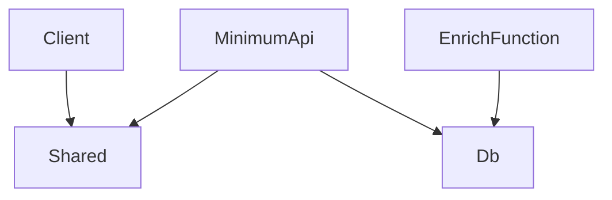
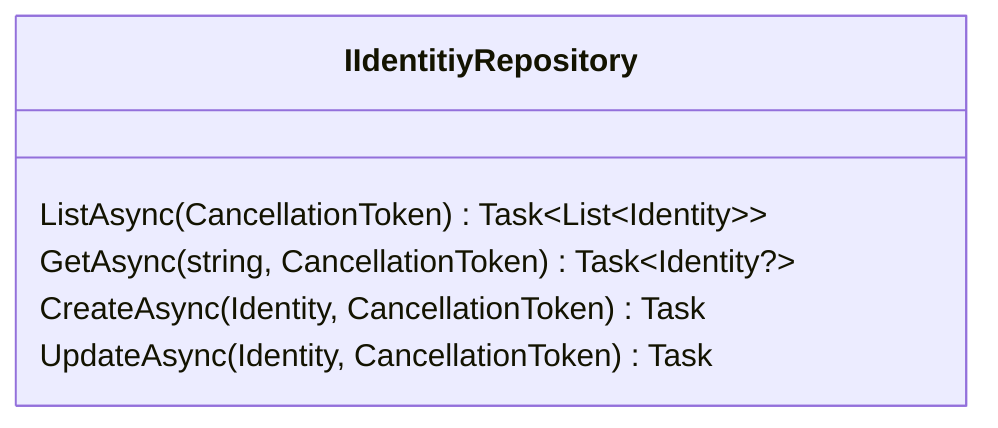

[顧客データ.csv](https://github.com/user-attachments/files/15800267/default.csv)

# 課題資料

これからみなさんには **mini** 版の **Sansan Data Hub** を作ってもらいます。

Sansan Data Hub がどんなビジネスシーンで使われるサービスなのか、ユーザーの課題をどう解決するのかを以下にまとめました。

## シナリオ

- ユーザー
    - マーケティング担当者
- 背景
    - 営業活動で得た「顧客データ」を csv としてまとめて保有している
- 営業活動の方針
    - 特定の**業種**毎に組織リストを作る
    - **直近の業績**が上昇傾向にある組織（企業や団体）を優先的にアプローチする
    
    ※「業種」とは企業が営む事業の種類のことです ex. 製造業, 小売業
    
- 営業活動における課題
    - 「顧客データ」の情報が不足している
        - **業種**情報が不足している為、活用できていない顧客情報がある
        - **業績**情報が不足している為、優先度未定のものがある
- 「顧客データ」の活用に課題を持ち、「データ統合から、マーケティングを加速する」という Sansan Data Hub にたどり着いた

## mini Sansan Data Hub ができること

**「顧客データ」から組織情報を識別して、リッチ化する**

### 用語説明

- 識別
    - 顧客データとSansan社が持っている組織リストを突合し、顧客データに組織を一意に特定するキーを付与すること
    - Sansan Data Hub ではこのキー項目を **SOC**（エスオーシー）と呼んでいます。SOC は Sansan Organization Code の略です
- リッチ化
    - 顧客データのリッチ化とは、基本的な顧客情報にさらに詳細な情報を付与することを指します。基本的な顧客情報には、名前、連絡先、住所などが含まれますが、これに加えて顧客の購買履歴、行動パターン、好み、趣味、嗜好、ソーシャルメディアのアクティビティなど、より深い洞察を提供する情報を追加することで、データは「リッチ」になります
    - 今回は **mini**版の Sansan Data Hub なので、追加する情報は「業種(主業種)」「最新期の業績売上高」だけですが、実際の Sansan Data Hub は様々な情報をリッチ化情報として提供しています

# 課題の進め方

- ChatGPT, GitHub Copilot の使用は OK です！
- 各課題が終わったら、メンターにチェックしてもらってください🙋‍♂️
- 少しでも悩んだり、困ったり、気になったことがあれば**随時メンターにヘルプを求めてかまいません🙆‍♂️**
- **ワークで利用する API にリクエストするための情報は Slack に投稿します！**
    - API URL と API Key があります。

# 入力データ

後述する課題用リポジトリ sci-intern-2024 内の README の「顧客データ.csv」を使います。

> [!Tip]  
> 今回使う顧客データ（ダミーデータ）は数十行ほどのデータですが、  
> 実際にSansan Data Hubが扱う顧客データは、１社当たり約数千件から数百万件のデータとなります。

# 課題のコードを動かす

1. **リポジトリを clone する**
    - 好きなGitクライアントで以下のリポジトリを clone する
        - https://github.com/eightcard/sci-intern-2024
        
        ※ GitHub アカウント / GitHub クライアントがない人はメンターに声をかけてください💁‍♀️
        
2. **Visual Studio Code でビルドする**
    1. Visual Studio Code を開く
    2. clone した `sci-intern-2024` フォルダを Visual Studio Code 上で開く
    3. Ctrl + Shift + P ( Mac の場合は Command + Shift + P )でコマンドパレットを開き、`Run Task` と入力して Enter

        
        
    4. `Build Sln` を選択

        
        
    5. `タスクの出力をスキャンせず続行/Continue without scanning the task output` を選択してEnter

        

3. **実行する**
    1. Ctrl + Shift + D で Run And Debug を開き `Frontend & Backend` を選択して実行してください

        
        
    2. ブラウザが開いて以下の画面が立ち上がれば OK
        1. もしブラウザが立ち上がらない場合、 [`https://localhost:7273/`](https://localhost:7273/) に直接アクセスしてみてください。
4. **動作チェック**
    1. `識別結果を表示する`をクリックする

        

    2. 下記画面がでれば OK （レコードは表示されず、ヘッダのみが表示される）

        

以上で課題のコードの動かし方の説明は終わりです。

リポジトリの構造を把握して、課題に進みましょう。

```markdown
- DataHubIntern.Client (Web画面の実装)
    - Pages
        - EnrichResults.razor
            - 画面URL : `/enriches`
            - リッチ化結果の表示画面。
        - Result.razor
            - 画面URL : `/result/{Id}`
            - SOC ごとの一覧表示画面。
        - Results.razor
            - 画面URL : `/results`
            - 識別結果一覧の表示画面。
        - UploadFile.razor
            - 画面URL : `/`
            - CSV ファイルのアップロード画面。

- DataHubIntern.Db (マイグレーションファイルや、テーブルの定義)

- DataHubIntern.EnrichFunctions (リッチ化を行う Azure Functions。課題5で使用)

- DataHubIntern.MinimumApi (Client からのリクエストを処理)
    - ApiClient
        - Models
            - APIクライアントで使用するモデルを定義。
        - IdentifyApiClient
            - 外部の識別APIへの接続と通信を担当。
        - RichInfoApiClient
            - 外部のリッチ化APIへの接続と通信を担当。
    - Repository
        - IdentityRepository
            - 識別されたデータに対して、取得や保存、更新などの操作を提供。
    - Services
        - EnrichService
            - リッチ化に関する操作を実行するサービス。
        - FileService
            - CSV に関する操作を実行するサービス。
            - ファイルのアップロード処理を提供。
        - IdentityService
            - 識別(Identity)に関する操作を実行するサービス。
            - データの一覧取得やフィルタリング、RawデータからIdentityの生成など、Identityに関する主要な操作を提供。

- DataHubIntern.Shared
    - Client, MinimumApi間で使われるモデルを定義。
```



# 課題1: 顧客データを DB に保存しよう

## 概要

- 顧客データは CSV ファイルで与えられる
- Web画面から CSV ファイルをインポートしよう
- インポートした顧客データを DB に保存しよう

## 詳細

- まずはアプリケーションを起動しましょう。以下のような画面になるはずです

    

- `顧客データ.csv` をインポートしてみましょう
- 今のままだと、1レコードもインポートがされないようです
- では、必要な部品を使って、送られてきたデータを `Identity` テーブルに保存してみましょう
    - Id でテーブルを検索し、レコードが存在すれば更新、存在しなければ作成すBるようにしましょう
    - 以下のインターフェースをもつ Repository クラスが使えそうです
 


- インポートされたレコードはそのままだと、型があいません。適切に変換してあげる必要があります。
    - `IdentityService` を見てみましょう。

## 結果の確認

### 確認手順

1. ファイルインポート画面にある`ファイルを選択`ボタンを押し、「顧客データ.csv」を選ぶ
2. `実行`ボタンを押す
3. 画面に Loading と表示されるので、インポート結果が表示されるまで待つ
4. `識別結果を表示する` ボタンを押し、識別結果確認画面でアップロードしたデータを確認する

### 期待する結果

- [ ]  顧客データの組織名から更新日時までの項目が画面に表示されていること（**SOC は空白で OK**）
- [ ]  読み込んだ CSV と同じ行数が画面に表示されていること
- 完成イメージ

    

    
> [!Important]  
> ✅ **ここまでできたら、メンターに見てもらおう**

🙍‍♂️顧客データが読み込めた。  
けど、まだ何も始まっていない。「識別」と「リッチ化」ができるようにしないと。

次の課題に進んでみましょう！

# 課題2: 顧客データを識別してみよう

## 概要

- 識別APIの仕様を理解しよう
- インポートした顧客データを識別 API を使って識別しよう
    - 識別結果を DB へ保存しよう

## 詳細

- **識別 API 仕様**
    
    与えられたデータを識別して 組織識別コード（SOC）を返却する。
    
    **Request**
    
    Endpoint: `/api/identify`  
    Request Method: `POST`  
    Media Type: `application/json`  
    Request Body: 
    ```json
    {
        "Id": "string",
        "OrganizationName": "string",
        "ZipCode": "string",
        "Address": "string",
        "Tel": "string",
        "Fax": "string",
        "Email": "string",
        "FirstName": "string",
        "LastName": "string",
        "FullName": "string",
        "Mobile": "string",
        "Url": "string",
        "Division": "string",
        "Position": "string",
        "CreatedAt": "string",
        "UpdatedAt": "string"
    }
    ```
    
    **Response**
    
    Status Code: 200  
    Response Body:
    ```json
    {
        "soc": "string",
    }
    ```
    
- 必要な部品を使って、送られてきたデータで 識別 API を叩いてみましょう
- `identifyApiClient` を活用してみましょう

## 結果の確認

### 確認手順

1. ファイルインポート画面にある`ファイルを選択`ボタンを押し、「顧客データ.csv」を選ぶ
2. `実行`ボタンを押す
3. 画面に Loading と表示されるので、インポート結果が表示されるまで待つ
4. `識別結果を表示する` ボタンを押し、識別結果確認画面でアップロードしたデータを確認する

### 期待する結果

- [ ]  顧客データが識別された結果、SOC に値が入っている（※すべてのレコードに値が入ってなくてよい）
- 完成イメージ

    

> [!Important]
> ✅ **ここまでできたら、メンターに見てもらおう**

🙍‍♂️「識別」ができるようになったぞ。  
でも識別できない（SOC が入っていない）データは何なんだろう？識別できなかった理由は何だったんだろう？

次の課題に進んでみましょう！

# 課題3: 識別するための要件を満たしていないデータを弾こう

## 概要

- 識別 API の仕様を理解しよう
- 識別するための要件を満たしてないデータがあったら、ユーザーへ何が足りないのかをエラーメッセージで伝えてあげよう
- 識別 API を無駄に実行しないようにため、識別要件を満たしているデータのみ識別 API に渡そう

## 詳細

- **識別 API 仕様**
    
    与えられたデータを識別して 組織識別コード（SOC）を返却する。
    
    - `OrganizationName` と `Email` の両方ともが空（ `null` または空文字列）の場合、識別しない
    - `CreatedAt` または `UpdatedAt` が空（ `null` または空文字列）の場合、識別しない
    - `Email` が不正な形式な場合、識別しない
    
    **Request**
    
    Endpoint: `/api/identify`  
    Request Method: `POST`  
    Media Type: `application/json`  
    Request Body:  
    ```json
    {
        "Id": "string",
        "OrganizationName": "string",
        "ZipCode": "string",
        "Address": "string",
        "Tel": "string",
        "Fax": "string",
        "Email": "string",
        "FirstName": "string",
        "LastName": "string",
        "FullName": "string",
        "Mobile": "string",
        "Url": "string",
        "Division": "string",
        "Position": "string",
        "CreatedAt": "string",
        "UpdatedAt": "string"
    }
    ```
    
    **Response**
    
    Status Code: 200  
    Response Body:  
    ```json
    {
        "soc": "string",
    }
    ```
    

- **バリデーション要件**
    - 1 レコードごとにバリデーションがされること
    - 以下の 3種類のバリデーションがされていること、またエラーメッセージが作られること
        - `OrganizationName` と `Email` の両方ともが空の場合
            - ErrorMessage : `会社名とメールアドレスが両方とも空の場合、識別ができません。`
        - `Email` の `@` 以降に `.` がない。または、 末尾が `.` になっている場合
            - ErrorMessage : `メールアドレスの形式が不正な場合、識別ができません。`
        - `CreatedAt` または `UpdatedAt` が空の場合
            - ErrorMessage : `作成日時もしくは更新日時が空の場合、識別ができません。`
    - 1レコードに対して複数のバリデーションエラーが検出された場合、すべてエラーとして返されること
    - エラーメッセージは、すべてのレコードのバリデーションが終わった後に、ひとまとめで返す

## **結果の確認**

### 確認手順

1. ファイルインポート画面にある`ファイルを選択`ボタンを押し、「顧客データ.csv」を選ぶ
2. `実行`ボタンを押す
3. 画面にLoading と表示されるので、インポート結果が表示されるまで待つ

### 期待する結果

- [ ]  インポートに成功したレコード数 (44) と失敗したレコード数 (9) が画面に表示されること
- [ ]  以下の通りエラーメッセージが表示される（詳細は完成イメージ参照）
    - [ ]  エラーになったのが CSV ファイルで何行目かと、エラーの内容が１行で表示されること
    - [ ]  複数行にエラーがある場合、すべての行のエラーが表示されること
    - [ ]  1行に複数のエラーがあった場合、同じ行に対するエラーがまとまって、複数の行で表示されること
- 完成イメージ

    

> [!Important]
> ✅ **ここまでできたら、メンターに見てもらおう**

🙍‍♂️識別できない理由も分かった。  
あとは、識別した組織情報を「リッチ化」できるようにしないと。

次の課題に進んでみましょう！

# 課題4: 組織情報をリッチ化しよう

## 概要

- リッチ化 API の仕様を理解しよう
- 識別された組織に対してリッチ化情報を付与しよう
- `リッチ化結果を表示する` ボタンを押すと、リッチ化を行うページがあるので、付与されたリッチ情報を Web で見れるようにしよう
    - ※この課題でクライアント側（ `DataHubIntern.Client` プロジェクト）のコードを変更する必要はありません

## 詳細

- **リッチ化 API 仕様**
    - 与えられた SOC に紐付くリッチ化情報を返す
    
    **注意事項**
    
    - **リクエストに応答を返すまで１秒かかる。**
    
    **Request**
    
    Endpoint: `/api/enrich/{soc}`
    
    Request Method: `GET`
    
    Request Body: なし
    
    **Response**
    
    ```json
    {
        "soc": "123456789",
        "mainIndustrialClassName": "ITコンサルティング業",
        "latestSalesAccountingTermSalesGreaterThan": 1000,
        "latestSalesAccountingTermSalesLessThan": 10000
    }
    ```
    
    - `soc`: リッチ情報が紐付く組織識別コード。文字列。
    - `mainIndustrialClassName`: 主業種。文字列。
    - `latestSalesAccountingTermSalesGreaterThan` : 最新期の業績売上レンジ小（下限）。数字（int）。
    - `latestSalesAccountingTermSalesLessThan` : 最新期の業績売上レンジ大（上限）。数字（int）。

- **リッチ化 要件**
    - ページを開いた時に保存済のリッチ化済の組織情報が画面に表示されること
        - 以下の情報を表示すること。
            - SOC、 主業種、業績売上高レンジ小、業績売上高レンジ大
    - `リッチ化` ボタンを押すと、**課題1～3**で保存済の識別データの組織情報に対してリッチ化が行われること
    - リッチ化を行った組織情報はデータベースに保存されること
    - 新規にリッチ化した組織情報は画面に反映されること

## 進め方

本課題は以下の順に進めてください

1. **テーブル設計**
2. **API クライアント実装**
3. **EnrichService実装**

### 1. **テーブル設計**

組織識別コード（SOC）に紐付くリッチ化情報を保存するテーブルを設計してください。

- SOC に紐付くリッチ化情報をすべて保持すること。

追加するテーブル構造が決まったら、 EntityFramework Core のマイグレーション機能を利用してテーブルの追加を行いましょう。

Entity Framework Core ツールが必要なのでインストールしてください。以下のコマンドを Visual Studio Code のターミナルで順番に実行してください。

- `dotnet new tool-manifest`
- `dotnet tool install dotnet-ef`

マイグレーションの仕方は以下です。

1. `DataHubIntern.Db`下にテーブル用のクラスを追加する。
    1. テーブルカラムは C# 上はプロパティで記述する必要があります。
2. `DataHubIntern.Db.InternDbContext` にデータベースセット（`DbSet<…>`）を追加する。
    1. 既にある `Identity` テーブルに関する記述を参考に記述してください。
3. データベースセット追加後、ターミナルで DataHubIntern/DataHubIntern.Db ディレクトリに移動し、以下のコマンドを実行してください。
    1. `dotnet ef migrations add AddEnrichTable`
    2. コードのマイグレーションが行われ、DataHubIntern/DataHubIntern.Db/Migration ディレクトリに {時刻}_addEnrichTable.cs 等が出来ていることを確認してください。
4. 変更をデータベースに対して適用しましょう。ターミナルで DataHubIntern/DataHubIntern.Db ディレクトリに移動し、以下のコマンドを実行してください。
    1. `dotnet ef database update`

公式の[ドキュメント](https://learn.microsoft.com/ja-jp/ef/core/managing-schemas/migrations/?tabs=dotnet-core-cli)もありますので参考にしてください。

### 2. **API クライアント実装**

`DataHubIntern.MinimumApi.ApiClient.RichInfoApiClient`の `GetRichInfoAsync()` を実装する必要があります。

`IdentifyApiClient` の実装が参考になります。インターフェースや「リッチ化 API 仕様」を見ながら、違いに気を付けて実装してください。

### 3. **EnrichService 実装**

リッチ化結果ページの実体は DataHubIntern.Client.EnrichResults.razor です。

呼び出しているサービスクラス DataHubIntern.MinimumApi.EnrichService を実装する必要があります。

- **EnrichService 仕様**
    
    **GetEnrichedOrganizationsAsync()**
    
    リッチ化済の組織情報をテーブルから取得し、返却する。    
    返り値の型は `DataHubIntern.Shared.GetEnrichedOrganizationsResponse` 。
    
    **EnrichOrganizationsAsync()**
    
    識別済データの SOC に紐付くリッチ情報を API から取得し、データベースへ保存する。
    返り値は無し。
    

データベースへのアクセスはクラス内にサンプルコードを記述してありますので参考にしながら実装してください。

EntityFramework Core を利用した記述でも構いません。

実装が終わったら動かしてリッチ化された情報を確認してみましょう。

## **結果の確認**

### 確認手順

1. リッチ化結果ページにアクセスする
2. `リッチ化` ボタンを押す
3. しばらく待つとリッチ化情報が付与される

### 期待する結果

- [ ]  SOCに紐づく 主業、最新期業績売上高レンジ(百万円)小、最新期業績売上高レンジ(百万円)大が表示されること
- 完成イメージ

    

✅ **ここまでできたら、メンターに見てもらおう**

# 課題5: 組織情報をリッチ化しよう **(Advanced)**

## 概要

- リッチ化処理を非同期化してみよう

## 詳細

課題4でメソッドで同期的にリッチ化を行いましたが、 SOC が多くなると、とてつもない実行時間がかかることに気づいた方もいると思います。  
ボタンを押した後に暫く応答が帰ってこないのは体験として悪いので、メッセージングを使って非同期にリッチ化を行ってみましょう。  
この課題では以下のことを行って頂きます。  
- Storage Queue を使ったリッチ化の非同期化
    - 一部の実装を Azure Functions 側 (DataHubIntern.EnrichFunctions) へ移動させる必要があります。
- 並列化によるリッチ化の速度上昇
- クライアント側から結果のポーリング

間違えたデータをデータベースに入れてしまった場合は、クエリを行うか、ファイルを削除して識別データの入力からやり直して下さい。

### 1. **Storage Queue エミュレートの準備**
ここではローカルで Azure Storage Queue を動かすため、 Azurite を利用してエミュレートを行います。  
Visual Studio Code の拡張機能タブから Azurite をインストールして下さい。  


1. 適当な場所に空のフォルダを作成する
2. Visual Studio Code でフォルダを開く
3. コマンドパレットを開き `azurite: Start` を実行する

### 2. **EnrichService から StorageQueue にメッセージを送信する**
キューにメッセージを送信するための実装を行う必要があります。  
`SendMessageToEnrichQueueAsync()` というメソッドが EnrichService に既に実装されていますが、動作させるためには一部修正が必要です。  
`enrich` キューのメッセージ仕様に沿うように修正して下さい。
- **enrich キューメッセージ仕様**
    - Json 形式
    - `DataHubIntern.Shared.Messages.EnrichMessage` に既にモデルが用意されています。
    
    ```json
    {
        "soc": "string",
    }
    ```
    
### 3. **DataHubIntern.EnrichFunctions.OrganizationEnrichFunction クラスの RunAsync() を実装**
Azure Functions のデバッグには Azure Functions Core Tools を入れる必要があります。  
[ドキュメント](https://learn.microsoft.com/ja-jp/azure/azure-functions/functions-run-local?tabs=windows%2Cisolated-process%2Cnode-v4%2Cpython-v2%2Chttp-trigger%2Ccontainer-apps&pivots=programming-language-csharp#install-the-azure-functions-core-tools)に従ってインストールして下さい（※社内 Wi-Fi 経由だと時間がかかることがあります）  
Azure Function のデバッグを行うには Run And Debug で `DataHubIntern.EnrichFunctions (Attach)` を選択して実行してください。

EnrichService で行っていたことを RunAsync に移動する必要があります。
- **RunAsync() 仕様**
    
    インプットとして EnrichMessage クラスの情報がシリアライズされた文字列が入力される。
    組織コード (SOC) に紐付くエンリッチデータを API から取得し、データベースに保存する。
    
### 4. **エンリッチ結果ページで結果をポーリングする**
`DataHubIntern.Client.EnrichResults.razor` のコードを変更し、一定間隔でポーリングするようにしましょう。  
500ms に1回ポーリングするようにしてください。

### 5. **並列度を上げる**
メッセージングサービスと Function を使うメリットは、スケールのしやすさにあります。  
`host.json` ファイルを変更して Function の並列度を変更し、リッチ化の処理の速度を上げてみましょう。  
[公式ドキュメント](https://learn.microsoft.com/ja-jp/azure/azure-functions/functions-bindings-storage-queue?tabs=in-process%2Cextensionv5%2Cextensionv3&pivots=programming-language-csharp#host-json)を参考にして下さい。  

## **結果の確認**

### 確認手順
1. リッチ化結果ページにアクセスする
2. `リッチ化` ボタンを押す
3. 徐々にリッチ化されたデータが表示されること

### 期待する結果
- [ ]  5秒以内にすべてのリッチ化が完了すること
- [ ]  SOC に紐づく 主業、最新期業績売上高レンジ(百万円)小、最新期業績売上高レンジ(百万円)大が表示されること

✅ **ここまでできたら、メンターに見てもらおう**

課題は以上で終了です。  
もし時間が余ったら、メンターに追加課題がないか相談してみてください。
